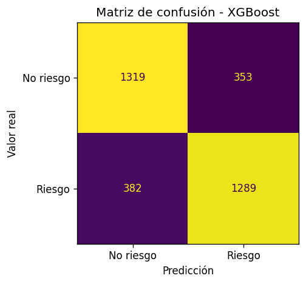
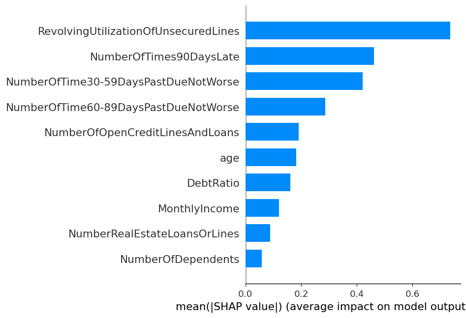
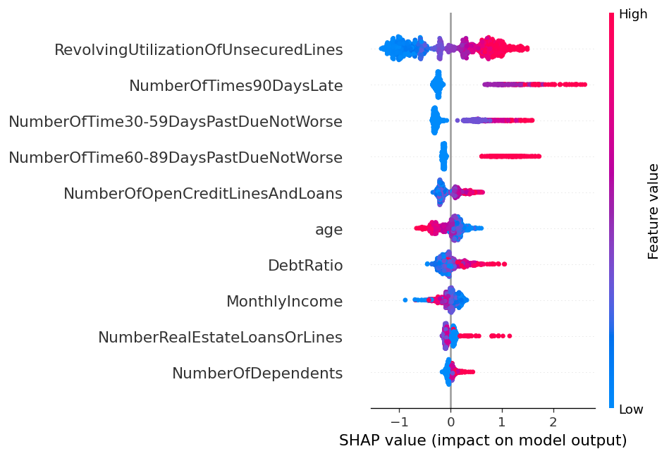

# Riesgo Crediticio con Machine Learning

Proyecto de Machine Learning orientado a la predicción de riesgo crediticio mediante clasificación binaria. El objetivo es estimar la probabilidad de que un cliente presente incumplimiento financiero, utilizando variables asociadas a utilización de crédito, endeudamiento, ingresos, historial de morosidad y comportamiento financiero previo.

El desarrollo se presenta con un notebook exploratorio inicial hacia una arquitectura modular en Python, con foco en reproducibilidad, separación de responsabilidades, evaluación comparativa de modelos, optimización de hiperparámetros, serialización del mejor modelo y explicabilidad mediante SHAP.

---

## Objetivo del proyecto

El propósito central del proyecto es demostrar un flujo completo de Machine Learning aplicado a riesgo crediticio:

- comprender la estructura del dataset mediante análisis exploratorio;
- construir un pipeline reproducible de carga, preprocesamiento, entrenamiento y evaluación;
- comparar modelos supervisados representativos para clasificación binaria;
- optimizar hiperparámetros de un modelo candidato;
- seleccionar el mejor modelo según métricas de desempeño;
- guardar el modelo final como artefacto reutilizable;
- interpretar el comportamiento del modelo mediante SHAP.

El foco no está en ejecutar una gran cantidad de algoritmos, sino en comparar familias de modelos con un criterio técnico claro y tomar decisiones metodológicas justificadas.

---

## Dataset

El dataset utilizado corresponde a información histórica de riesgo crediticio disponible en OpenML.

El conjunto de datos contiene variables numéricas relacionadas con:

- utilización de líneas de crédito no aseguradas;
- edad;
- historial de atrasos entre 30 y 59 días;
- ratio de endeudamiento;
- ingreso mensual;
- número de líneas de crédito abiertas;
- atrasos superiores a 90 días;
- créditos o líneas inmobiliarias;
- atrasos entre 60 y 89 días;
- número de dependientes.

La variable objetivo original es `SeriousDlqin2yrs`, transformada en el proyecto como `riesgo`.

| Clase | Interpretación |
|---|---|
| 0 | Cliente sin incumplimiento serio |
| 1 | Cliente con incumplimiento serio |

Después de la limpieza inicial, el dataset final contiene:

| Elemento | Valor |
|---|---:|
| Observaciones | 16.712 |
| Variables predictoras | 10 |
| Variable objetivo | 1 |
| Clases | Balanceadas |
| Valores nulos | No detectados |
| Duplicados eliminados | 2 |

---

## Estructura del proyecto

```text
riesgo_crediticio/
│
├── data/
│   ├── raw/
│   └── processed/
│
├── models/
│   └── best_model.pkl
│
├── notebooks/
│   └── 01_exploracion_datos.ipynb
│
├── reports/
│   ├── metrics.csv
│   └── figures/
│       ├── confusion_matrix_best_model.png
│       ├── shap_feature_importance.png
│       └── shap_summary.png
│
├── src/
│   ├── data_loader.py
│   ├── preprocessing.py
│   ├── train.py
│   ├── evaluate.py
│   ├── explainability.py
│   └── utils.py
│
├── main.py
├── requirements.txt
├── .gitignore
└── README.md
```

---

## Flujo metodológico

El proyecto se organiza en dos niveles: una fase analítica inicial y una fase de modelado reproducible.

### 1. Exploración inicial

El notebook `notebooks/01_exploracion_datos.ipynb` cumple el rol de bitácora analítica. En esta etapa se revisó:

- dimensión del dataset;
- tipos de variables;
- estructura de la variable objetivo;
- valores nulos;
- duplicados;
- distribución de clases;
- estadísticos descriptivos;
- percentiles y presencia de outliers.

La exploración permitió definir decisiones posteriores del pipeline, como la eliminación de duplicados, el tratamiento de outliers y la separación entre modelos que requieren escalamiento y modelos basados en árboles.

---

### 2. Carga de datos

El módulo `src/data_loader.py` se encarga de:

- descargar el dataset desde OpenML;
- consolidar la variable objetivo;
- renombrar el target como `riesgo`;
- convertir el target a tipo entero;
- eliminar duplicados;
- separar variables predictoras `X` y variable objetivo `y`.

Esto permite que el proyecto sea reproducible sin depender de archivos locales de datos.

---

### 3. Preprocesamiento

El módulo `src/preprocessing.py` implementa un transformer personalizado llamado `OutlierClipper`.

Este transformer aplica clipping al percentil 99, pero con una condición metodológica importante: los límites de clipping se aprenden exclusivamente desde el conjunto de entrenamiento mediante `fit()` y luego se aplican a train/test mediante `transform()`.

Esto evita fuga de información desde el conjunto de prueba hacia el modelo.

Se definieron dos pipelines de preprocesamiento:

| Tipo de modelo | Preprocesamiento |
|---|---|
| Modelo lineal | OutlierClipper + StandardScaler |
| Modelos basados en árboles | OutlierClipper |

El escalamiento se aplica sólo al modelo lineal, ya que Random Forest, AdaBoost y XGBoost no lo requieren para operar correctamente.

---

### 4. Entrenamiento de modelos

El módulo `src/train.py` entrena cuatro modelos base representativos para clasificación binaria:

| Modelo | Familia | Rol en el proyecto |
|---|---|---|
| Logistic Regression Elastic Net | Modelo lineal regularizado | Baseline interpretable |
| Random Forest | Ensemble / Bagging | Modelo robusto no lineal |
| AdaBoost | Boosting clásico | Comparación con boosting secuencial |
| XGBoost | Gradient Boosting | Modelo avanzado para datos tabulares |

Además, se implementó una segunda fase de optimización para Random Forest mediante `RandomizedSearchCV`.

La optimización se realiza únicamente sobre `X_train`, utilizando validación cruzada interna. El conjunto de prueba se reserva exclusivamente para la evaluación final.

---

### 5. Evaluación de modelos

El módulo `src/evaluate.py` evalúa los modelos sobre el conjunto de prueba y genera una tabla comparativa con las siguientes métricas:

- Accuracy;
- Precision;
- Recall;
- F1-Score;
- AUC-ROC.

La métrica principal de selección fue AUC-ROC, ya que permite evaluar la capacidad discriminativa del modelo independientemente de un umbral fijo de clasificación.

En riesgo crediticio, esta métrica es especialmente relevante porque permite medir qué tan bien el modelo ordena a los clientes según su probabilidad estimada de incumplimiento.

---

## Resultados

Los resultados finales obtenidos fueron:

| Modelo | Accuracy | Precision | Recall | F1-Score | AUC-ROC |
|---|---:|---:|---:|---:|---:|
| XGBoost | 0.7813 | 0.7862 | 0.7726 | 0.7794 | 0.8624 |
| Random Forest Optimized | 0.7765 | 0.7824 | 0.7660 | 0.7741 | 0.8579 |
| Logistic Regression Elastic Net | 0.7709 | 0.7873 | 0.7421 | 0.7640 | 0.8525 |
| AdaBoost | 0.7730 | 0.7757 | 0.7678 | 0.7717 | 0.8520 |
| Random Forest | 0.7712 | 0.7732 | 0.7672 | 0.7702 | 0.8514 |

El modelo con mejor desempeño general fue **XGBoost**, alcanzando un AUC-ROC de **0.8624**.

---

## Optimización de hiperparámetros

Aunque XGBoost fue el modelo final seleccionado, la optimización de Random Forest permitió demostrar el efecto del ajuste de hiperparámetros sobre el rendimiento predictivo.

| Modelo | AUC-ROC |
|---|---:|
| Random Forest base | 0.8514 |
| Random Forest optimizado | 0.8579 |

La optimización mediante `RandomizedSearchCV` mejoró el rendimiento de Random Forest en AUC-ROC, lo que evidencia la utilidad de ajustar hiperparámetros de forma sistemática.

Sin embargo, el mejor rendimiento global fue alcanzado por XGBoost, por lo que fue seleccionado como modelo final.

---

## Visualizaciones del proyecto

### Matriz de confusión



### Importancia global de variables con SHAP



### SHAP Summary Plot



---

## Matriz de confusión

Además de la tabla comparativa de métricas, el proyecto genera una matriz de confusión para el mejor modelo.

Archivo generado:

`reports/figures/confusion_matrix_best_model.png`

Esta visualización permite analizar la distribución de:

- verdaderos positivos;
- verdaderos negativos;
- falsos positivos;
- falsos negativos.

En un problema de riesgo crediticio, esta información es relevante porque los errores de clasificación tienen implicancias distintas: clasificar como no riesgoso a un cliente que sí presenta riesgo puede tener un costo financiero mayor que clasificar conservadoramente a un cliente sin riesgo.

---

## Explicabilidad del modelo con SHAP

Para complementar la evaluación predictiva, se incorporó una etapa de explicabilidad mediante SHAP.

El módulo `src/explainability.py` permite interpretar el comportamiento del modelo ganador, identificando las variables que más contribuyen a la predicción de riesgo.

Archivos generados:

- `reports/figures/shap_feature_importance.png`
- `reports/figures/shap_summary.png`

La explicabilidad global muestra que las variables más relevantes para el modelo fueron:

- `RevolvingUtilizationOfUnsecuredLines`;
- `NumberOfTimes90DaysLate`;
- `NumberOfTime30-59DaysPastDueNotWorse`;
- `NumberOfTime60-89DaysPastDueNotWorse`;
- `NumberOfOpenCreditLinesAndLoans`.

Estos resultados son coherentes con el problema analizado, ya que el modelo asigna mayor relevancia a variables asociadas a utilización del crédito, historial de morosidad y comportamiento financiero previo.

---

## Ejecución del proyecto

### 1. Clonar el repositorio

```bash
git clone <URL_DEL_REPOSITORIO>
cd riesgo_crediticio
```

### 2. Crear entorno virtual

```bash
python -m venv venv
```

Activar entorno en Windows PowerShell:

```bash
venv\Scripts\Activate.ps1
```

Activar entorno en CMD:

```bash
venv\Scripts\activate
```

### 3. Instalar dependencias

```bash
pip install -r requirements.txt
```

### 4. Ejecutar pipeline completo

```bash
python main.py
```

Este comando ejecuta el flujo completo:

- carga de datos;
- limpieza inicial;
- separación train/test;
- entrenamiento de modelos;
- optimización de Random Forest;
- evaluación final;
- generación de métricas;
- matriz de confusión;
- guardado del mejor modelo;
- gráficos SHAP.

---

## Archivos generados

Al ejecutar `python main.py`, se generan los siguientes artefactos:

- `reports/metrics.csv`
- `reports/figures/confusion_matrix_best_model.png`
- `reports/figures/shap_feature_importance.png`
- `reports/figures/shap_summary.png`
- `models/best_model.pkl`

El archivo `models/best_model.pkl` corresponde al pipeline completo del modelo ganador, incluyendo preprocesamiento y estimador final.

---

## Tecnologías utilizadas

- Python
- Pandas
- NumPy
- Scikit-learn
- XGBoost
- SHAP
- Matplotlib
- Joblib
- Jupyter Notebook

---

## Decisiones técnicas relevantes

### Uso de notebook como fase analítica

El notebook se mantiene como espacio de exploración, diagnóstico y justificación de decisiones. El pipeline productivo se implementa en scripts modulares dentro de `src/`.

### Prevención de data leakage

Las transformaciones que aprenden parámetros del dato, como el clipping de outliers, se ajustan exclusivamente sobre el conjunto de entrenamiento dentro de pipelines de Scikit-learn.

### Uso de AUC-ROC como métrica principal

AUC-ROC fue seleccionada como métrica principal porque mide la capacidad del modelo para discriminar entre clientes con y sin riesgo, independientemente de un umbral fijo de clasificación.

### Optimización controlada

Se aplicó `RandomizedSearchCV` a Random Forest para demostrar ajuste sistemático de hiperparámetros sin convertir el proyecto en una búsqueda exhaustiva innecesaria.

### Explicabilidad

Se incorporó SHAP para interpretar el modelo final, conectando desempeño predictivo con comprensión de variables relevantes para el riesgo crediticio.

---

## Conclusión

El proyecto demuestra un flujo completo de Machine Learning aplicado a riesgo crediticio, desde la exploración inicial del dataset hasta la construcción de un pipeline modular, evaluación comparativa de modelos, optimización de hiperparámetros, selección del mejor estimador, serialización del modelo y explicabilidad mediante SHAP.

La versión final transforma un notebook exploratorio inicial en un proyecto profesional, reproducible y preparado para portafolio, orientado a evidenciar competencias en ciencia de datos aplicada, modelamiento supervisado, evaluación de modelos y comunicación técnica de resultados.

---

Proyecto desarrollado en el marco de formación de Diplomado en Ciencia de Datos, profesionalizado para portafolio en Machine Learning aplicado.